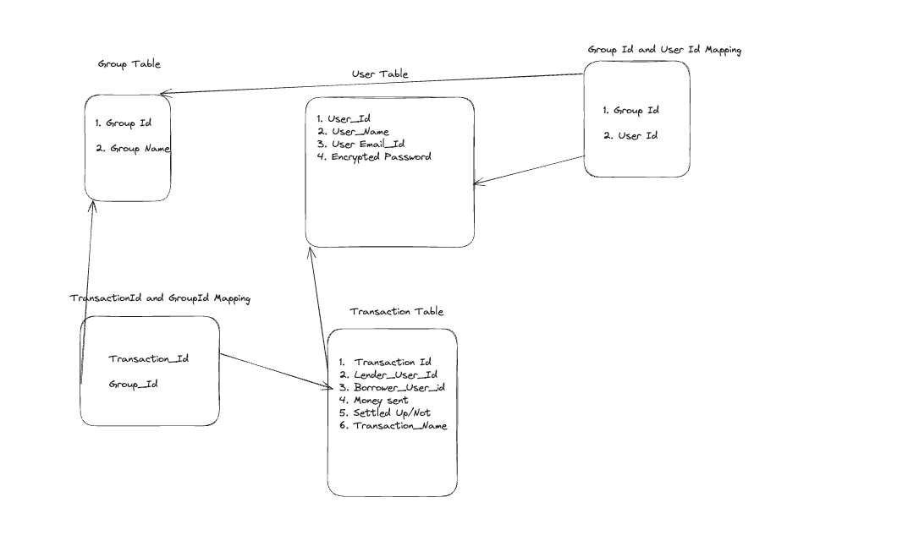

### SPLIT BUDDIES DATABASE SCHEMA DESIGN

**USER_TABLE**
 
This table has all the details of registered user to this system. The primary key of this table is User_Id which uniquely identifies a user against the plethora of users hooked to system.

Description of column names are as follows :

1. **User_Id**: Unique user identifier
2. **User_Name** : Name of the user which is used for displaying.
3. **User_Email_Id**:  Email Id of the user entered during registration phase.
4. **User_Password**: Encrypted password stored in db.

 

**GROUP_TABLE**

 

 This table as all the information related to groups created by user. The primary key is Group_Id. The description of columns is as follows:

  

 1. **Group_Id**: Unique Identifier Of the Group, which keeps on incrementing as the new group gets added by users.
 2. **Group_Name**: Name of the Group used for displaying.

 

 **USER_GROUP_MAPPING**

 

 Since the USER_TABLE and GROUP_TABLE has a many to many relationship , adhering to normalization this table is created with User_Id and Group_Id has the composite primary key.

 **TRANSACTION_TABLE**

 Since we have transaction has the currency according to this system terminology. This table is introduced to store all attributed pertaining to transaction. The primary key is Transaction_Id which is an unique identifier of all the transactions present in system. The description of columns is as follows:

 1. **Transaction_Id** : Unique identifier of the transaction.
 2. **Transaction_Name** : Display name of the transaction.
 3. **Lender_User_Name** : Display name of the lender of the transaction.
 4. **Borrower_User_Name** : Display name of the borrower of the transaction.
 5. **IsSettled**: Boolean value which tells the status of transaction.
 6. **Group_Id** : Since the transaction and group has to 1 to many relationship (i.e a group will have multiple transactions). This is foreign key reference to group table.
